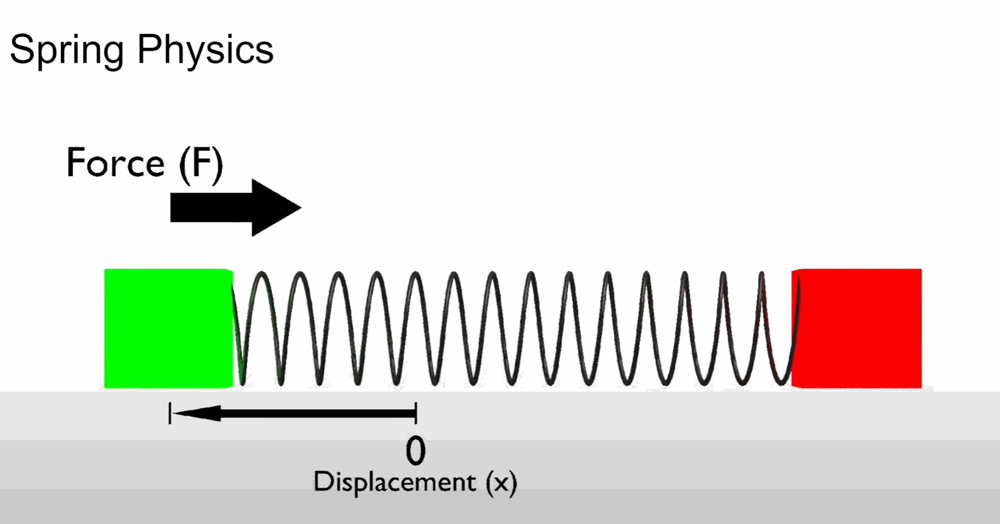
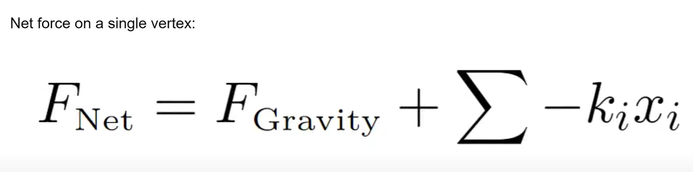
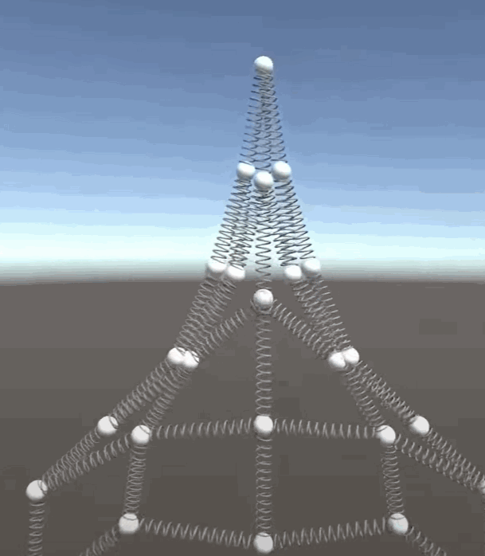
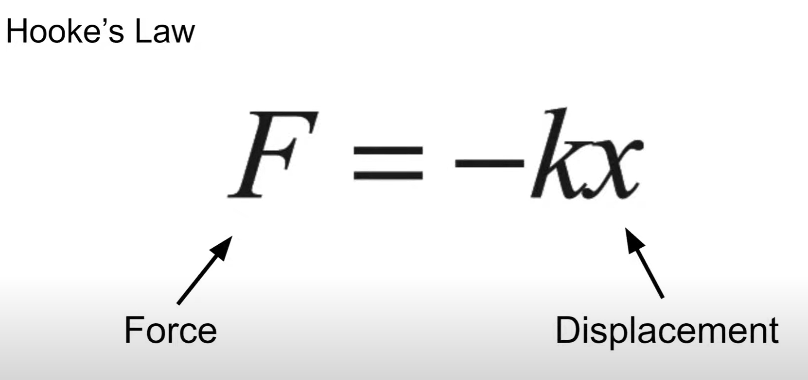
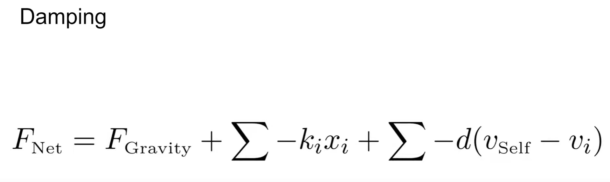
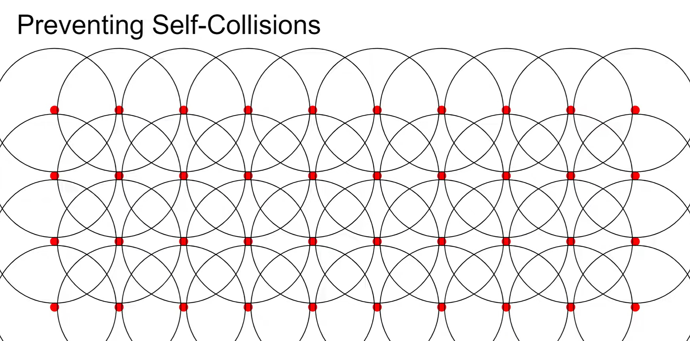

# CIS565-Final-Project-Fabric Forge

* Runjie Zhao
* Akiko Zhu

## Project Overview
This is a real-time webGPU-based cloth simulation project that implements a dry frictional contact model based on the Signorini Coulomb law. This offers an accurate simulation of friction and non-penetrative contact and boosts the simulation efficiency with the help of GPU computing.

## Features
- WebGPU pipeline
  - [x]  Compute pipeline (particle generation, mass-spring-damper model, force generation, intersection)
  - [x]  Graphics pipeline 
  - [x]  GUI controller
- Algorithm implementation
  - [x]  Edge triangle collision detection
  - [x]  triangle intersection
  - [x]  particle free fall compute
  - [ ]  Projective-Dynamics-based forward simulation
  - [ ]  Gradient computation
- Enhanced rendering
  - [ ]  Texture loading and material rendering
  - [ ]  Cloth with animation

## Interaction Guide
Use mouse's left drag, wheel, and right drag to control the camera  

## Algorithms and Approaches
### Particle and node structure
In this project, we use a structure that takes each vertex as a node and stores the position, velocity, acceleration, springs, and associated triangles in the node. By associating each vertex with those attributes, we can simulate physical particle system based on the mass-spring-damper model.
|Physical System|
|:-:|
||

### Hooke's law and damping
In this project, we use Hooke's law to describe the relationship between the force exerted on a spring given its displacement from static.
By using a simple way to simulate the force, we now notice the horizontal and vertical springs can shear. Therefore, we add diagonal springs connecting all the vertices to make the springs connection more stable.
|Simple net force|Node|
|:-:|:-:|
|||

|Hooke's law|Damping|
|:-:|:-:|
|||

|Stable|Free fall|
|:-:|:-:|
|||

### Collision detection
Because under the force influence, we don't want our cloth to self-intersect. To prevent the self-intersection, we draw a small sphere around each of the vertices of our cloth. We ignore if the reverse sphere intersects with one of its neighbors, but if two spheres intersect that are not neighbors of each other, we will move each other so that they are no longer colliding.
|Sphere Colliders|
|:-:|
||

### Milestone Presentation
[Milestone 1](https://docs.google.com/presentation/d/1k1ChnuoMpLSQxMTS-dWUVtKKRyZDLQiFZErbInyIAtg/edit?usp=sharing) 
[Milestone 2](https://docs.google.com/presentation/d/1sv0X3YxA0IU9tFmVsZB1DE7m33s-xZ-jeRxQN0ryYoc/edit?usp=sharing)
[Milestone 3](https://docs.google.com/presentation/d/1iPj2AqlVhUsPVGc2NFhWof8Bf9a0nz_nUCBRBUU-FCI/edit?usp=sharing)

## Reference
[1] https://people.csail.mit.edu/liyifei/publication/diffcloth/  
[2] https://people.csail.mit.edu/liyifei/uploads/DiffCloth_SIGGRAPH_8_min.pdf  
[3] https://igl.ethz.ch/projects/dynamic-garments/  
